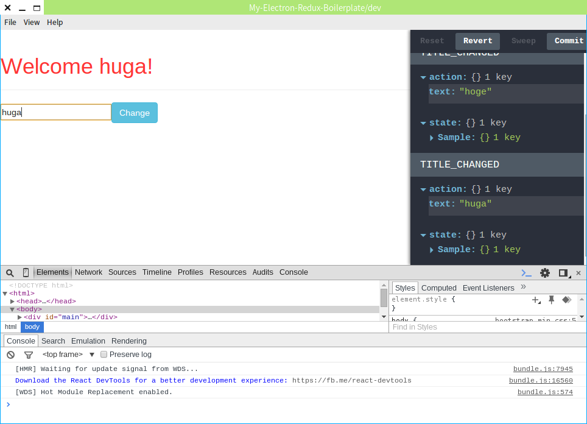

# My-Electron-Redux-Boilerplate
Electron application boilerplate based on React, Redux, webpack, bootstrap.



## Run

run webpack dev server

```bash
$ npm run start-dev-server
```

and, in another terminal.

run electron

```bash
$ npm run start-dev
```

## Bibliography
- https://github.com/banderson/generator-redux
- https://github.com/airtoxin/Electron-React-Boilerplate